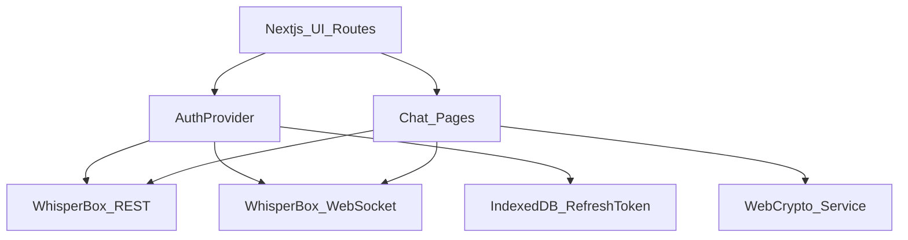

# WhisperBox Client (E2EE)

End-to-end encrypted (E2EE) messaging client for the WhisperBox backend.

- **Plaintext never leaves the client**
- **Server stores only ciphertext blobs**
- **Only the intended recipients (and the sender) can decrypt**

Backend:
- **Base URL**: `https://whisperbox.koyeb.app/`
- **Docs**: `https://whisperbox.koyeb.app/docs#`

## Architecture



## Encryption flow (hybrid crypto)

WhisperBox uses **hybrid encryption**:

1. Generate a random **AES-GCM 256-bit** key per message.
2. Encrypt plaintext with AES-GCM → `ciphertext` + `iv`.
3. Export the AES key bytes and encrypt them twice using **RSA-OAEP**:
   - with the **recipient** public key → `encryptedKey`
   - with the **sender** public key → `encryptedKeyForSelf`
4. Send/store only this payload:

```ts
type EncryptedPayload = {
  ciphertext: string; // base64
  iv: string; // base64
  encryptedKey: string; // base64 (RSA-OAEP over AES key)
  encryptedKeyForSelf: string; // base64 (RSA-OAEP over AES key)
};
```

Decryption happens locally:
- Recipient decrypts `encryptedKey` with their private key to recover AES key, then decrypts `ciphertext`.
- Sender can decrypt `encryptedKeyForSelf` to read their own sent messages.

## Key management

Each user has:
- **Public key (RSA-OAEP)**: stored on backend.
- **Private key (RSA-OAEP)**: never leaves the client in plaintext.

### Register
Client-side:
- Generate RSA-OAEP keypair.
- Derive an AES key-wrapping key from the user password via **PBKDF2**.
- Wrap the private key using **AES-KW**.
- Send to `POST /auth/register`:
  - `public_key` (SPKI, base64)
  - `wrapped_private_key` (PKCS8 wrapped by AES-KW, base64)
  - `pbkdf2_salt` (base64)

### Login / session restore
- `POST /auth/login` returns the wrapped private key + salt.
- Client re-derives the wrap key from the password and **unwraps** the private key into memory.
- This app stores the **refresh token** in **IndexedDB** and restores sessions by calling `POST /auth/refresh`, then `GET /auth/me` to restore the user profile/key blobs.
- If the session is restored, the UI enters a **Locked** state until the user provides their password to unwrap the private key again.

## Security notes & trade-offs

- **No plaintext on the server**: the server only sees ciphertext + encrypted AES keys + iv.
- **Private key not persisted unwrapped**: it is kept as an in-memory `CryptoKey` only.
- **Refresh token storage**: this implementation persists refresh tokens in IndexedDB for convenience. This improves UX but is still vulnerable to XSS (like any JS-accessible storage). A hardened version would add strict CSP, audit dependencies, and potentially avoid persistence (or encrypt at rest with an OS-bound secret, where available).
- **Replay/dup handling**: messages are deduped by message `id` in the UI.
- **Forward secrecy**: not implemented in this V1 (would require protocol changes, e.g. X3DH/Double Ratchet).

## Project structure

- `src/lib/api/whisperbox.ts`: typed REST client + schemas
- `src/lib/crypto/crypto.ts`: WebCrypto primitives (RSA-OAEP, AES-GCM, PBKDF2 + AES-KW)
- `src/lib/crypto/whisperbox-crypto.ts`: WhisperBox payload encrypt/decrypt
- `src/lib/ws/whisperbox-ws.ts`: WebSocket client (reconnect/backoff)
- `src/lib/auth/session.tsx`: session state, refresh, unlock, WS integration
- `src/lib/storage/idb.ts`: IndexedDB key-value helpers
- `src/app/(auth)/*`: login/register
- `src/app/(chat)/*`: conversations + thread UI

## Running locally

```bash
npm install
npm run dev
```

Then open `http://localhost:3000`.

## Using the app

1. Register a new user (keys generated locally).
2. Search for another user and start a conversation.
3. Send messages — they are encrypted **before** sending.
4. If you reload, your session may restore, but you’ll be asked to **unlock** to decrypt/send.

## Known limitations (V1)

- No group chats
- No attachments
- No multi-device key sync
- No forward secrecy / double-ratchet
- WebSocket frame format is implemented per docs guidance; if the backend WS schema changes, update `src/lib/ws/whisperbox-ws.ts`.
